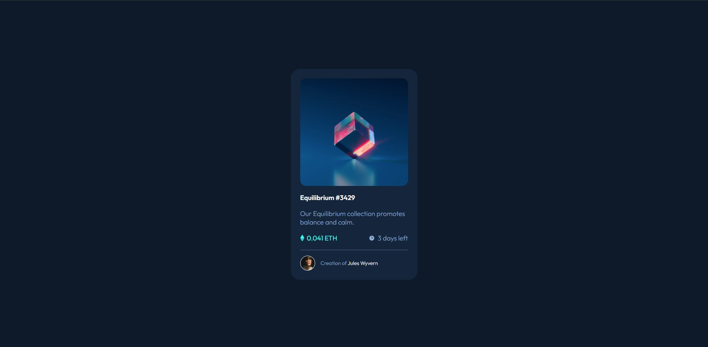
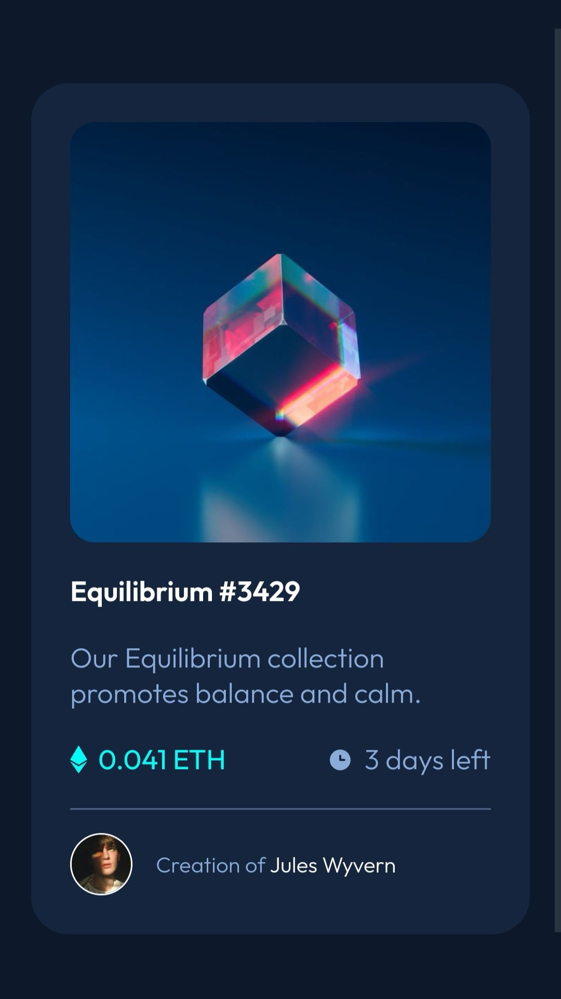

# Frontend Mentor - NFT preview card component solution

This is a solution to the [NFT preview card component challenge on Frontend Mentor](https://www.frontendmentor.io/challenges/nft-preview-card-component-SbdUL_w0U). Frontend Mentor challenges help you improve your coding skills by building realistic projects. 

## Table of contents

- [Overview](#overview)
  - [The challenge](#the-challenge)
  - [Screenshot](#screenshot)
  - [Links](#links)
- [My process](#my-process)
  - [Built with](#built-with)
  - [What I learned](#what-i-learned)
  - [Useful resources](#useful-resources)
- [Author](#author)

## Overview

### The challenge

Users should be able to:

- View the optimal layout depending on their device's screen size
- See hover states for interactive elements

### Screenshot

### Links

- Solution URL: [Github repo](https://github.com/deavenrivaldi/nft_preview_card_challenge)
- Live Site URL: [Website](https://deavenrivaldi.github.io/nft_preview_card_challenge/#)

## My process

### Built with

- Semantic HTML5 markup
- CSS custom properties
- Flexbox
- Desktop-first workflow

### What I learned

In this challenge I try to implement all the html structures and css styling I've learnt from the previous challenge. This time, I didn't watch any solution video or any video related to HTML and CSS to complete the challenge, so everything I made here are original and based on previous experiences. 

One new thing that I learned from this challenge is to make an image overlay for the active state of the main image. At first it tried to make something based on my understanding, but the image overlay ended up in failure, so I try to google for the correct way to make an image overlay and it turns out successful

Still the same as the previous challenges, the styling for this challenge is also based on feelings and I'm very much satisfied with the end result. I feel that as I practiced, I started to get a better feeling to style the website according to the example images given.

### Useful resources

- [w3schools](https://www.w3schools.com/) - w3schools has always been the first website I look up to when I want to know more about the css styling I'm about to use

## Author

- Website - [Deaven Rivaldi](https://deavenrivaldi.github.io/first-website/)
- Frontend Mentor - [@deavenrivaldi](https://www.frontendmentor.io/profile/deavenrivaldi)
- LinkedIn - [Deaven Rivaldi](https://www.linkedin.com/in/deavenrivaldi/)
